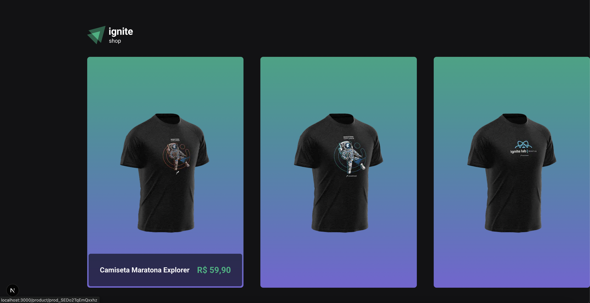
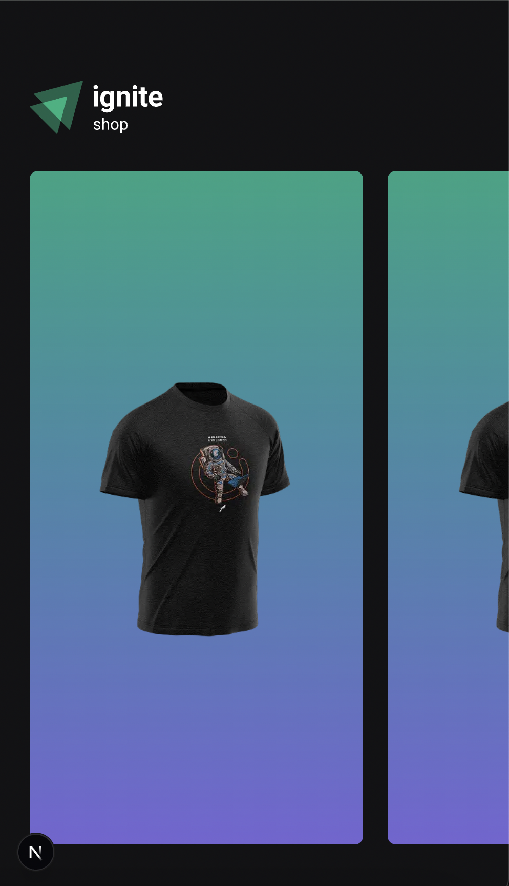
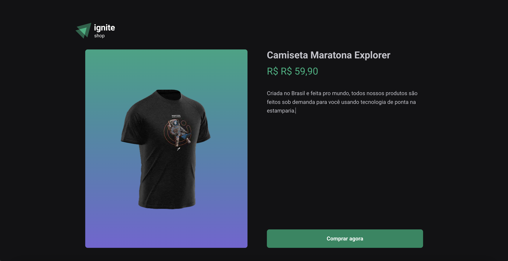
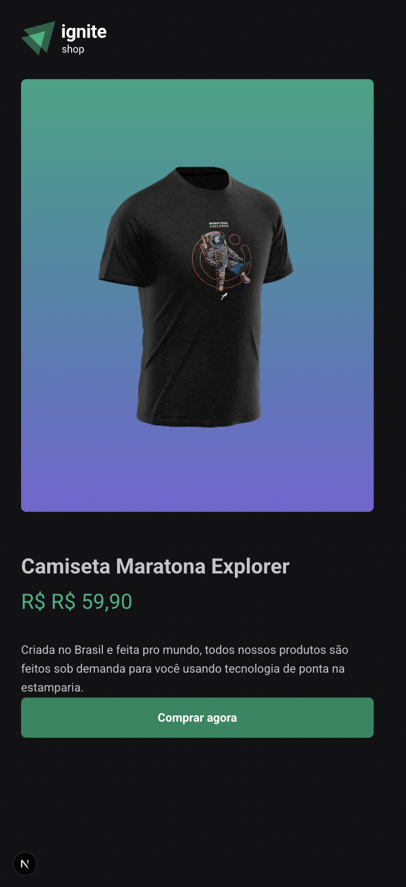

# 🛍️ Ignite Shop

Projeto desenvolvido durante a **Maratona Ignite da Rocketseat** com o objetivo de praticar conceitos de **Next.js** e integração com **Stripe**.  
É uma aplicação de e-commerce simples, com listagem de produtos e fluxo de checkout integrado.

## 🚀 Funcionalidades

- Listagem de produtos cadastrados no Stripe
- Carrossel responsivo de produtos (com [Keen Slider](https://keen-slider.io/))
- Página de detalhes de cada produto
- Integração com Stripe Checkout para realizar a compra
- Geração estática (SSG) com revalidação incremental
- Estilização responsiva com [Stitches](https://stitches.dev/)

## 🖼️ Screenshots

### Página Inicial



### Página de Produto



> As imagens acima são exemplos de como o projeto está renderizando.

## 🛠️ Tecnologias utilizadas

- [Next.js](https://nextjs.org/) — Framework React para produção
- [React](https://react.dev/)
- [TypeScript](https://www.typescriptlang.org/)
- [Stripe](https://stripe.com/) — API de pagamentos
- [Axios](https://axios-http.com/) — Requisições HTTP
- [Keen Slider](https://keen-slider.io/) — Carrossel responsivo
- [Stitches](https://stitches.dev/) — CSS-in-JS moderno

## 📦 Como executar localmente

1. Clone o repositório:
```bash
git clone https://github.com/santyasm/ignite-shop.git
cd ignite-shop
```

2. Instale as dependências:
```bash
npm install
#ou
yarn install
````

3. Configure as variáveis de ambiente no arquivo .env.local:

```bash
STRIPE_API_KEY=sk_test_xxxxxxxxxxxxxxxxx
NEXT_URL=http://localhost:3000
```

4. Rode o projeto em modo desenvolvimento:
```bash
npm run dev 
#ou
yarn dev
```

---

Feito com 💜 por Yasmin durante a Maratona Ignite